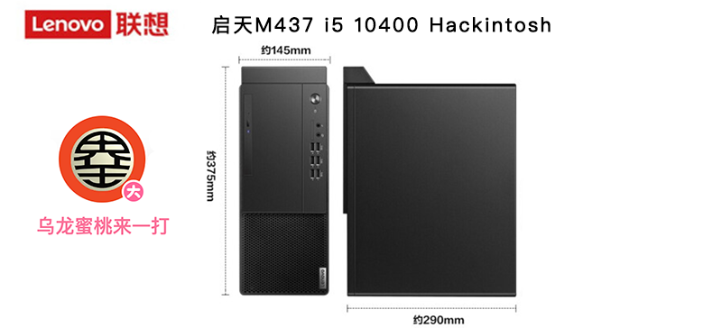
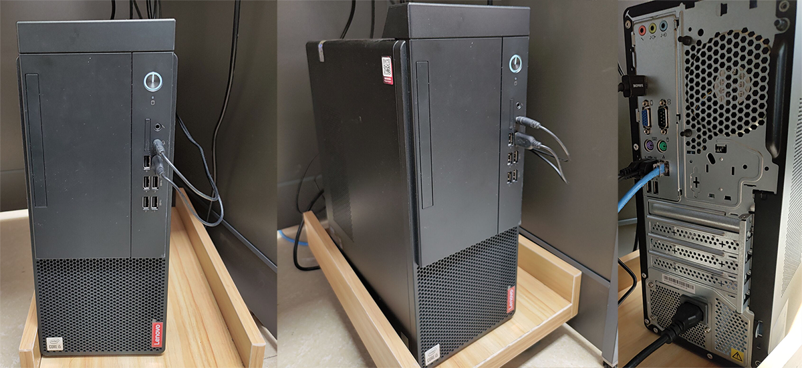

## Lenovo-QiTian-M437 Intel Gen10 Hackintosh OpenCore EFI

### [简体中文](README.zh_CN.md)

### OpenCore

[OpenCore 0.9.1](https://github.com/acidanthera/OpenCorePkg)

### OS Version Tested

- macOS Monterey 12.x
- macOS Ventura  13.x 

### Hardware

- Motherboard: Lenovo H470
- Bios Version: 
- CPU: Intel i5-10500
- RAM: Kingston 8GB DDR4 3200 + ADATA 8GB DDR4 3200
- SSD: Lenovo x800 256G nvme m.2 2280
- iGPU: Intel UHD Graphic 630
- Audio: Realtek ALC897
- Ethernet Card: Realtek 8168
- PSU: 250W 

### Notes
 - Use [OpenCore Configurator](https://mackie100projects.altervista.org/opencore-configurator/) build your SMBIOS
 - U Must Use CFGLock.efi Tool Unlock CFG LOCK first

### Known issues

- No Wireless LAN Adapter，So `WiFi` and `Bluetooth` unserviceable .

### PC CASE
