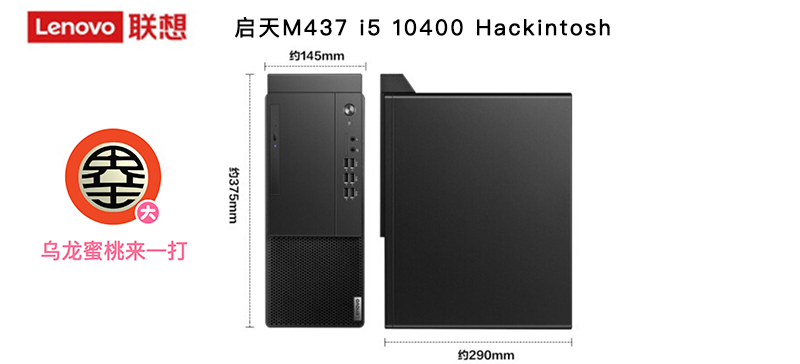

## Lenovo启天M437 10代 黑苹果 OpenCore EFI

### [English](https://github.com/hackintosh-efi/Lenovo-QiTian-M437)

### OpenCore

[OpenCore 1.0.4](https://github.com/acidanthera/OpenCorePkg)

### 可安装系统

- macOS Monterey 12.x
- macOS Ventura   13.x 
- macOS Sonoma  14.x
- macOS Sequoia  15.x  

### 硬件
- 主板: 联想 H470
- Bios版本: 
- 处理器: 英特尔 i5-10500
- 内存: 金士顿 8GB DDR4 3200 + 威刚 8GB DDR4 3200
- 硬盘: 联想 x800 256G nvme m.2 2280
- 核显: 英特超核心显卡 630
- 声卡: 瑞昱 ALC897
- 网卡: 瑞昱 8168
- 电源: 250W

### 注意事项
 - 首次安装前，必须在OC UI界面按空格键后，选择CFG Lock工具解锁BIOS中的CFG Lock
 - 安装成功后请务必使用 [OCAuxliaryTools](https://github.com/ic005k/OCAuxiliaryTools) 重新生成 SMBIOS
 - 

### Known issues

- 未安装无线网卡，故`WiFi` 和 `蓝牙` 无法使用

### 机箱展示

### 联系我们

 - QQ群: 23304408

